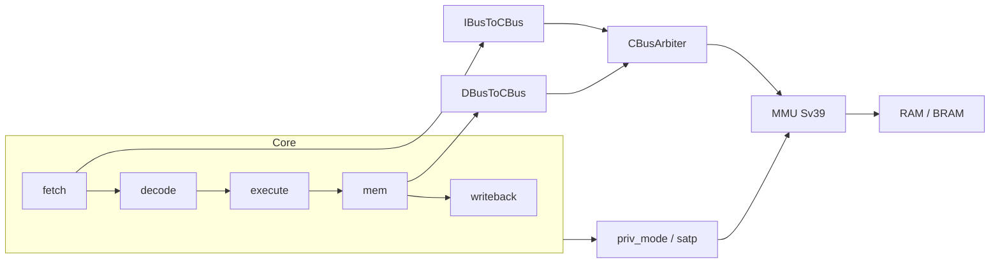

## Lab5 五级流水 CPU：特权级、异常与 Sv39 分页实现报告

### 1 实现目标与约束

Lab5 在 Lab1～Lab4 已完成的五级流水、真实访存、分支重定向、CSR 指令与 Difftest 对齐框架之上，要求 CPU 具备可运行的特权与分页环境，使 `ready-to-run/lab5` 中的 xv6 内核能够完成启动、初始化与用户态第一段代码的执行。具体而言，本阶段需要补齐 `ecall` 与 `mret` 的语义，使环境调用能进入 M 态 trap handler，并在 `usertrapret` 路径上通过 `mret` 回到用户程序入口；需要维护 `priv_mode` 以及 `mstatus` 中与 trap 进入/返回相关的 `MIE`、`MPIE`、`MPP`、`MPRV` 等字段；需要在取指与访存路径上接入 Sv39 页表翻译，并在翻译失败时产生 instruction page fault（cause 12）或 load/store page fault（cause 13/15），将 PC 重定向到 `mtvec` 并更新 `mepc`、`mcause`、`mtval`。总线侧采用“仲裁后单 MMU”的集成方式：`CBusArbiter` 汇聚 I/D 请求后，由 `MMU` 统一做地址翻译再访问下游存储。实现仍遵循此前实验的最小侵入原则：不推翻五级流水骨架，在 `decode.sv`、`core.sv`、`fetch.sv`、`mem.sv` 及 `util/` 下增量扩展；Lab4 的 CSR 写后 `pc+4` 顺序化重定向保留，与 trap/ecall/mret 的重定向通过不同的 `redirect_valid` 来源区分。

### 2 总体设计思路

整体设计延续 `vsrc/src/` 下的模块化划分，`core.sv` 继续作为 trap 控制中枢与 CSR 架构状态的唯一维护点。Lab5 的增量可以概括为四条主线。第一条在译码阶段识别 `ecall`（`0x00000073`）与 `mret`（`0x30200073`），并保留 Lab4 对 `ebreak` 与 CSR 指令的译码路径。第二条在 ID/EX 边界将 trap 类控制流与分支错预测、CSR 写后重定向合并进统一的 PC 重定向仲裁：`trap_redirect_valid` 覆盖 `ecall`、取指 fault、访存 fault 与 `mret`；`fetch_redirect_valid` 在此基础上再并入 CSR 与分支事件，并对 `instr_fault_fire` 做拆分，避免取指 fault 与 fetch 内 `redirect_valid` 形成组合环。第三条新增 `priv_mode` 与 `mmu_priv`：`priv_mode` 为架构可见特权级，`mmu_priv` 在 `mret`/`ecall` 重定向当拍提前更新，保证 MMU 与 `fetch` 锁存的 `req_priv` 在首条用户态取指时已看到 U 态。第四条在 `VTop.sv` / `SimTop.sv` 中将 `CBusArbiter` 输出接入 `MMU.sv`，`core` 通过 `priv_mode_o`（接 `mmu_priv`）与 `satp_o` 驱动翻译；`fetch` 与 `mem` 分别输出 `ireq_priv`、`dreq_priv`，由仲裁器在 `busy` 时锁存为 `saved_priv`。

### 3 特权级与 trap 控制（`core.sv` / `decode.sv`）

译码模块在 `SYSTEM` 类指令、`funct3==000` 的分支中，除原有 `ebreak` 外增加对 `ecall` 与 `mret` 的识别，分别置位 `is_ecall`、`is_mret`。trap 的“发射点”放在 ID/EX 级：当 `id_ex.valid` 且对应标志成立、且当前无 `mem_wait`、未 `cpu_halt` 时，组合逻辑产生 `ecall_fire` 或 `mret_fire`。`ecall` 时将 `mepc` 设为 `id_ex.pc`，`mcause` 按当前 `priv_mode` 选择（U 态为 8，M 态为 11），并按规范更新 `mstatus`（保存 `MIE` 到 `MPIE`、清 `MIE`、将 `MPP` 设为原特权级），同时把 `priv_mode` 与 `mmu_priv` 置为 M。`mret` 时 PC 重定向目标不再直接读 `csr_mepc` 寄存器，而读旁路后的 `exec_mepc_view`；`mstatus` 按 `MPIE` 恢复 `MIE`、`MPP` 恢复为 U，并根据 `MPP` 恢复 `priv_mode`；若返回目标非 M 态则清除 `MPRV`。

取指页错与访存页错分别由 `fetch_fault` 与 MEM 级 `dresp.fault` 上报。`instr_fault_fire` 在取指响应带 `fault` 时置位，更新 `mepc=fetch_pc`、`mcause=12`、`mtval=fetch_pc`，并走与 `ecall` 相同的 `mstatus` 保存逻辑；`fetch` 的 `flush` 仅接 `instr_fault_fire`，页错不参与 fetch 内部的 `redirect_valid`，从而打破 “fault → redirect → 新取指 → fault” 的组合环。访存页错在 `mem_out_valid` 且 `out_fault` 时形成 `mem_fault_fire`，`mcause` 区分 store（15）与 load（13），`mtval` 为访存有效地址。

CSR 写后顺序化（Lab4）与 trap 重定向共存：`csr_redirect_valid` 仍指向 `pc+4`，`fetch_redirect_valid` 不含 `instr_fault_fire`；`trap_redirect_valid` 使用 `exec_mtvec_view` / `exec_mepc_view`，对 EX/MEM/WB 中尚未写回的 `csrw mepc`/`mtvec` 做旁路，避免板端长访存 stall 下 `mret` 用到过期的 `mepc`（例如误回到 `usertrapret` 中 `jalr trapret` 的返回地址 `0x80001f18`）。`DifftestCSRState.priviledgeMode` 改为接 `priv_mode`，不再恒为 M。

### 4 取指级改动（`fetch.sv`）

取指模块由 Lab1～Lab3 的“单拍脉冲 `ireq.valid`”改为 hold-valid 模型：`ireq.valid` 由 `req_pending_q` 驱动，自 `start_request` 起保持至 `response_fire`（`data_ok` 上升沿）为止。`start_request` 在 `!stop_fetch && !flush && !redirect_valid && !req_pending_q && !data_valid_q` 时成立，保证 `mret`/`ecall` 重定向当拍不会以旧特权发起新的取指请求。指令缓存使用 `data_valid_q`，仅当 `fetch_accept` 为真时推进 `pc_q` 并清空 `data_valid_q`；`core` 侧 `fetch_accept` 还要求无 `fetch_redirect_valid_gated`、无 `instr_fault_fire`、无 `mem_wait`，避免重定向或 fault 当拍错误接收旧指令。`redirect_valid` 与 `flush` 分离：`flush` 仅用于 instruction page fault，二者在 redirect/flush 时均可丢弃在途响应（`drop_resp_q`）。`req_priv_q` 在 `start_request` 时锁存 `current_priv`（来自 `mmu_priv`），供 `CBusArbiter` 与 MMU 使用。`iresp.fault` 在 `response_fire` 拍置位 `fetch_fault`，供顶层 trap 逻辑使用。

### 5 访存级与总线（`mem.sv` / `util/`）

MEM 级在 Lab2 pending 模型上增加 `resp_fire`（`data_ok` 上升沿）完成判定，与取指侧一致，减轻 Vivado 路径上多拍 `data_ok` 误完成的问题。`cur_done` 在访存 fault 时亦视为完成，并通过 `out_fault` 向 `core` 上报。`req_priv` 在 pending 期间锁存发起时的 `current_priv`。`common.sv` 中为 `ibus_resp_t`、`dbus_resp_t`、`cbus_resp_t` 增加 `fault` 字段；`DBusToCBus` 对取指路径设置 `is_fetch`，将 MMU 返回的 fault 传回 core。

`CBusArbiter.sv` 增加 `iprivs` 输入与 `opriv` 输出，`busy` 时 `opriv` 为锁存的 `saved_priv`，空闲默认 M（仅作占位，MMU 实际以 `core` 的 `mmu_priv` 为准）。`VTop.sv` / `SimTop.sv` 数据通路为：`core` → `IBusToCBus`/`DBusToCBus` → `CBusArbiter` → `MMU` → 片外/仿真 RAM；`MMU.priv_mode` 与 `MMU.satp` 分别接 `mmu_priv`、`satp_o`。

### 6 MMU（Sv39）实现（`util/MMU.sv`）

`MMU` 模块对上游 CBus 请求做 Sv39 翻译。当 `priv_mode_q != M` 且 `satp[63:60]==8` 时进入页表遍历：在 `MMU_IDLE` 锁存 `req_q`、`priv_mode_q`、`satp_q`；经 `MMU_CHECK` 后按 VPN2→VPN1→VPN0 三级读 PTE（非叶子继续 walk，叶子检查 `V/R/W/X` 与 U 位）；最终在 `MMU_FINAL_REQ` 用物理地址向下游发起原请求，并根据 `req_q.is_fetch` 区分取指与 load/store 的 PTE 权限检查。未启用翻译时直通虚拟地址。非法 PTE 或权限不足进入 `MMU_FAULT`，对上游回 `fault=1`。读通路使用 `resp_armed_q`，在 BRAM 多拍延迟环境下延后一拍再采 `dn_resp.data`，降低板级“`data_ok` 已到但数据仍为 0”的风险。写通路保持组合完成，避免 MMIO 写被额外拖延。

### 7 主要修改文件

| 文件 | 改动要点 |
|------|----------|
| `src/decode.sv` | 识别 `ecall`、`mret` |
| `src/core.sv` | `priv_mode`/`mmu_priv`、trap 重定向、`exec_mepc_view`、页错/ECALL/MRET CSR 更新、fetch 握手与 Difftest 特权 |
| `src/fetch.sv` | hold-valid 取指、`req_priv`、fault、`redirect`/`flush` 分离、`data_ok` 边沿 |
| `src/mem.sv` | `req_priv`、`resp_fire`、fault 上报 |
| `util/MMU.sv` | 新增 Sv39 状态机、fault、`resp_armed_q` |
| `util/CBusArbiter.sv` | `iprivs`/`opriv` 特权锁存 |
| `VTop.sv` / `SimTop.sv` | 插入 MMU、连接 `satp`/`mmu_priv` |
| `include/common.sv` | 总线 `fault`、`is_fetch` 字段 |

### 8 验证情况说明

功能仿真执行 `cd 26-Arch && make test-lab5`，加载 `ready-to-run/lab5/kernel.bin`，在 Difftest 与 NEMU 参考模型对比下应能跑通内核启动流程。
