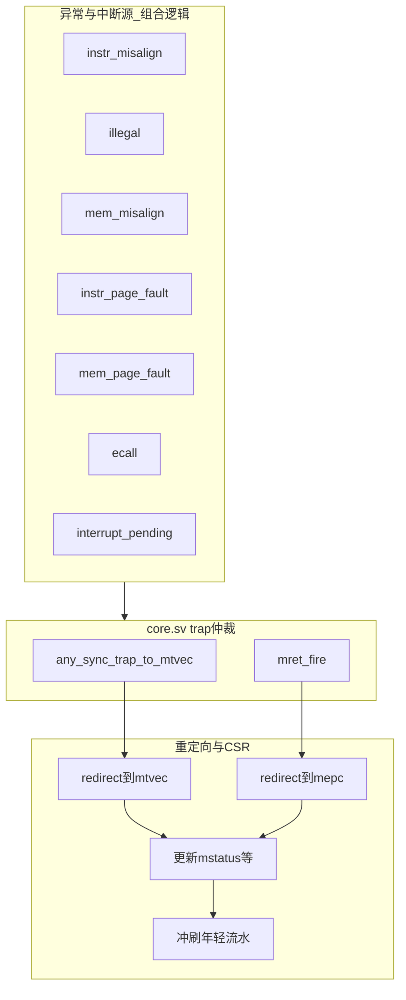

## Lab6 五级流水 CPU：中断与异常实现报告

### 1 实现目标与约束

Lab6 在 Lab1～Lab5 已完成的五级流水、访存、CSR、特权级与 Sv39 分页框架之上，补齐 RISC-V 特权规范中的同步异常与 M 态外部中断处理能力。本阶段需要支持：指令地址非 4 字节对齐（cause 0）、非法指令（cause 2）、load/store 地址非对齐（cause 4/6）、保留 Lab5 的取指/访存页错与 `ecall`/`mret`；将 CLINT 提供的 `trint`（MTIP）、`swint`（MSIP）、`exint`（MEIP）合并进 `mip` 并与 `mie` 共同判定可响应中断；在 `lab6-test.bin` 的 sys-test 中通过 `ecall_u`、各类 misalign、`timer_intr`、`software_intr` 及 `m_trap_test`（期望约 50 次定时器打印后 `m_trap_test [X]` 属正常）。实现仍遵循最小侵入原则：不新增独立 trap 模块，在 `core.sv` 内以组合 `_fire` 信号与既有 `trap_redirect_valid`/`fetch_redirect_valid` 复用 Lab5 重定向与冲刷框架；源检测逻辑禁止依赖 `redirect_pc` 等重定向结果，避免组合环。

### 2 总体设计思路

整体设计继续在 `vsrc/src/` 下增量扩展，主线分为四条。（1）**异常源**：在 IF、ID、MEM 各阶段分别产生 `instr_misalign_fire`、`illegal_fire`、`mem_misalign_fire`，与 Lab5 的 `instr_fault_fire`、`mem_fault_fire`、`ecall_fire` 一并送入 trap 仲裁。（2）**中断源**：`SimTop`/`RAMHelper2` 输出 `trint/swint/exint`，在 `core` 中映射为 `mip` 的 MTIP/MSIP/MEIP 位并与 CSR 中的 `mip` 按掩码合并；`pending = (mip & mie)` 且满足特权级与 `MIE` 门控后产生 `interrupt_fire`。（3）**trap 统一出口**：除 `mret` 外，异常与中断均走 `any_sync_trap_to_mtvec`，PC 重定向到 `exec_mtvec_view`，并更新 `mepc/mcause/mtval/mstatus/priv_mode`。（4）**CSR 写回与 trap 时序**：Lab4 仅对 `csrw satp` 保留 redirect+冲刷；`mstatus`/`mtvec` 等走正常五级流水写回；中断当拍需阻止 EX/MEM 中滞后的 `mstatus` CSR 写回覆盖 trap 刚写入的 `MPP/MPIE`，否则 `m_trap_test` 中 `mret` 会错误回到 U 态，定时器中断只能触发一次。

### 3 同步异常实现

#### 3.1 指令地址非对齐（IF）

当 `fetch_valid` 且 `fetch_pc[1:0] != 2'b00` 时置位 `instr_misalign_fire`。`mepc`/`mtval` 取 `fetch_pc`，`mcause=0`。取指侧 `ifetch_trap_flush` 包含 `instr_misalign_fire` 与 `instr_fault_fire`，但 **不** 将 `instr_fault_fire` 并入 `fetch_redirect_valid`，延续 Lab5 打破 “fault → redirect → 新取指 → fault” 组合环的做法。

#### 3.2 非法指令（ID）

`decode.sv` 对各 opcode 的 `default` 分支置 `is_illegal=1` 并关闭 `reg_write`。`illegal_fire = if_id.valid & dec_is_illegal & ~mem_wait & ~cpu_halt`；trap 时 `mepc=if_id.pc`，`mtval={32'b0, if_id.instr}`，`mcause=2`。

#### 3.3 访存非对齐（MEM）

`mem.sv` 增加 `addr_aligned()`：按 `mem_size` 检查 1/2/4/8 字节访问的对齐约束。未对齐时 `addr_misaligned=1`，不发起 `dreq.valid`，`cur_done` 当拍完成并置 `out_misaligned`。`core` 在 `mem_out_valid & mem_out_misalign_fault` 时 `mem_misalign_fire`，`mcause` 为 load 4 或 store 6，`mtval` 为访存有效地址。

#### 3.4 页错与 ecall（沿用 Lab5）

取指页错（cause 12）、访存页错（13/15）、`ecall`（U=8/M=11）逻辑与 Lab5 一致，纳入同一 `any_sync_trap_to_mtvec` 仲裁链。进入 trap 时共用 `ecall_mstatus_new` 模板：保存 **架构寄存器中的** `MIE` 到 `MPIE`（不能存 `mie_effective`，见第 5 节）、清 `MIE`、写 `MPP` 为当前 `priv_mode`，`priv_mode`/`mmu_priv` 切 M。

### 4 中断实现

#### 4.1 外部中断线与 mip 合并

`core` 端口接入 `trint, swint, exint`。组合逻辑：

- `MIP_EXT_MTIP = 0x80`（bit 7）
- `MIP_EXT_MSIP = 0x8`（bit 3）
- `MIP_EXT_MEIP = 0x800`（bit 11）

`mip_for_read = (csr_fwd_mip & MIP_MASK) | mip_ext`，读 CSR 与 pending 判定均使用合并后的值。仿真中 `RAMHelper2` 维护 `mtime/mtimecmp/msip`，每拍更新 `trint <= mtime > mtimecmp`，`swint <= msip`；测试程序通过 MMIO 写 `0x38004000`（mtimecmp）、`0x38000000`（msip）配置定时器与软件中断。

#### 4.2 可响应条件与 interrupt_fire

1. `irq_masked = mip_for_read & csr_mie`
2. `irq_eligible = (priv_mode != M) || mie_effective`，其中 `mie_effective = mstatus.MIE | csrsi_opens_mie_ex`
3. `irq_active = irq_mei | irq_msi | irq_mti`（各自为 eligible 与对应 pending 位之与）
4. **U 态**：`interrupt_fire` 在 `irq_active` 上升沿触发（`irq_active_prev` 寄存上一拍 pending）
5. **M 态**：仅在 `csrsi_opens_mie_ex` 为真时触发——即 EX/MEM 级正在执行 `csrrsi mstatus` 且将 MIE 从 0 置 1 的当拍，与 `m_trap_test` 中 `csrsi` 后立即 `csrci` 的测试意图一致

`mcause` 选择优先级：MEI（11）> MSI（3）> MTI（7），中断编码 `mcause[63]=1`。

#### 4.3 中断 mepc 与 m_trap 测试语义

`m_trap_test` 循环体为：`csrsi mstatus,8`（开 MIE）→ `csrci mstatus,8`（关 MIE）→ `bgez` 回环；定时器 handler 检查 `mepc == int_allow`（`csrci` 的 PC）。因此：

1. `csrsi_opens_mie_ex` 为真时，`irq_mepc_pc` 固定为 `ex_mem.pc + 4`（指向 `int_allow`）
2. 其它阶段用 `arch_pc_next` 从 ID/EX/IF 当前 PC 选取，避免中断点落在错误指令上

handler 内 `set_timer` 重装 `mtimecmp`，`mret` 回到 `int_allow` 后继续循环，直至计数器减到 0。

### 5 CSR、mret 与流水写回的关键时序

#### 5.1 仅 SATP 触发 CSR redirect

`csr_write_needs_flush()` 仅对 `CSR_SATP` 返回真。`mstatus`/`mtvec` 的 `csrw`/`csrrsi` 不再 redirect，避免 `m_trap_test` 开头背靠背 `csrw mtvec` 与 `csrsi/csrci` 在写回前被冲掉。

#### 5.2 trap 进入时 MPIE 必须存“真 MIE”

`m_trap` 在 M 态通过 `csrsi` 当拍的 `mie_effective` 看到 MIE 即将打开，但 CSR 寄存器里 MIE 仍为 0。若 trap 把 `MPIE` 存成 1，则 `mret` 会恢复 `MIE=1`，后续再无 `csrsi` 的 0→1 边沿，定时器中断只能进 handler 一次。故 `ecall_mstatus_new[MSTATUS_MPIE_BIT] = csr_mstatus[MSTATUS_MIE_BIT]`（架构 MIE，非 effective）。

#### 5.3 中断当拍屏蔽滞后的 mstatus CSR 写回

中断在 `csrsi` 处于 EX/MEM、trap 逻辑同拍更新 `mstatus`（`MPP=M`、`MIE=0` 等）时，若允许该 CSR 指令进入 `mem_wb` 并在更晚写回，会 **覆盖** trap 写入的 `MPP`，导致 `mret` 回到 U（`priv=0`），`m_trap_test` 只能打印一次 “Timer interrupt…”。修复：当 `interrupt_fire && ex_mem` 为写 `mstatus` 的 CSR 时，强制 `mem_wb.valid <= 0`。同时 `mem_wb` 的 CSR 更新块排在所有 trap 分支 **之后**，避免中断当拍 WB 把 MIE 写回 1 盖掉 trap 清零。

#### 5.4 mret 与 XS

`mret_mstatus_new` 除恢复 `MIE/MPIE/MPP` 外，按规范将 `mstatus.XS` 清 0；`MSTATUS_MASK` 已包含 XS 域可写位。返回非 M 态时清除 `MPRV`。

#### 5.5 错路径写回抑制与 mstatus 背靠背 CSR

分支错预测或 trap redirect 时，若 EX/MEM 与 ID/EX 为同拍相邻且后者为误路径，默认会 `suppress_wrong_path_wb` 抑制 EX 级写回。`m_trap` 中 `csrsi@pc` 与 `csrci@pc+4` 为故意背靠背写 `mstatus`，通过 `ex_id_seq_csr_mstatus` 与 `ex_mem_mstatus_csr_seq` 排除误杀；`csrci` 后接 `bgez` 时亦不得把 `csrci` 当误路径，否则 MIE 无法清除。`interrupt_fire` 当拍不对 `ex_mem` 做 suppress，以保证 `mepc` 与 CSR 时序正确。

### 6 重定向与冲刷优先级（`core.sv`）

1. `trap_redirect_valid = mret_fire | any_sync_trap_to_mtvec`
2. `trap_redirect_pc`：`mret` → `exec_mepc_view`（旁路 EX/MEM/WB 未提交的 mepc）；trap → `exec_mtvec_view`
3. `fetch_redirect_valid` 在 trap 基础上增加 `illegal/mem_misalign/interrupt/ecall`、**不含** `instr_fault_fire`；另含 `csr_redirect`（仅 SATP）、分支错预测、预测跳转
4. `pipeline_flush_young` 在 `branch_mispredict | csr_redirect | trap_redirect` 时清空 IF/ID、ID/EX
5. `mmu_priv` 在 `mret`/`trap` 重定向当拍提前更新，保证下一拍取指/访存特权正确

### 7 主要修改文件

| 文件 | 改动要点 |
|------|----------|
| `include/csr.sv` | `MIP_MASK`、`MSTATUS_MASK`（含 XS）；CSR 地址常量 |
| `src/decode.sv` | `is_illegal`；各 opcode 非法编码检测 |
| `src/core.sv` | 异常/中断 `_fire`、trap 仲裁、`mip_ext`、`interrupt_fire`、`csrsi_opens_mie_ex`、中断 mepc、MPIE 语义、中断当拍屏蔽 mstatus WB、mstatus 背靠背例外、`mret` 清 XS |
| `src/mem.sv` | `addr_aligned`、`out_misaligned`；非对齐不发起总线请求 |
| `src/fetch.sv` | （沿用 Lab5）`instr_fault` 仅走 flush、不进 `fetch_redirect_valid` |
| `SimTop.sv` / `VTop.sv` | `trint/swint/exint` 接入 `core` |

### 8 调试过程中定位的根因（m_trap 仅 1 次定时器打印）

现象：sys-test 前面子项均 `[OK]`，但 `m_trap_test` 只打印一行 “Timer interrupt in test_trap…”，随后 `[X]`。日志分析结论：

1. **定时器硬件正常**：`mtimecmp` 多次写入，`trint` 多次 0→1，说明 CLINT 与 `set_timer` 路径无问题
2. **第二次 trap 时 `prv=0`（U 态）**：`mret` 后本应在 M 态继续 `csrsi/csrci` 循环，实际却落到 U，导致 M 态 `csrsi_opens_mie_ex` 触发条件失效
3. **根因**：第一次 timer 中断恰在 `csrsi mstatus` 写回窗口命中 trap；滞后的 CSR 写回把 `MPP` 覆盖为旧值（U），破坏 `mret` 返回特权级
4. **修复**：中断当拍丢弃 EX/MEM 中对 `mstatus` 的 CSR 写回进入 WB；并保证 trap CSR 更新优先于普通 `mem_wb` CSR 写回

修复后 `make test-lab6` 可连续打印约 50 次定时器信息，最终 `Test m_trap [OK]`、`Privileged test finished.`。

### 9 验证情况说明

